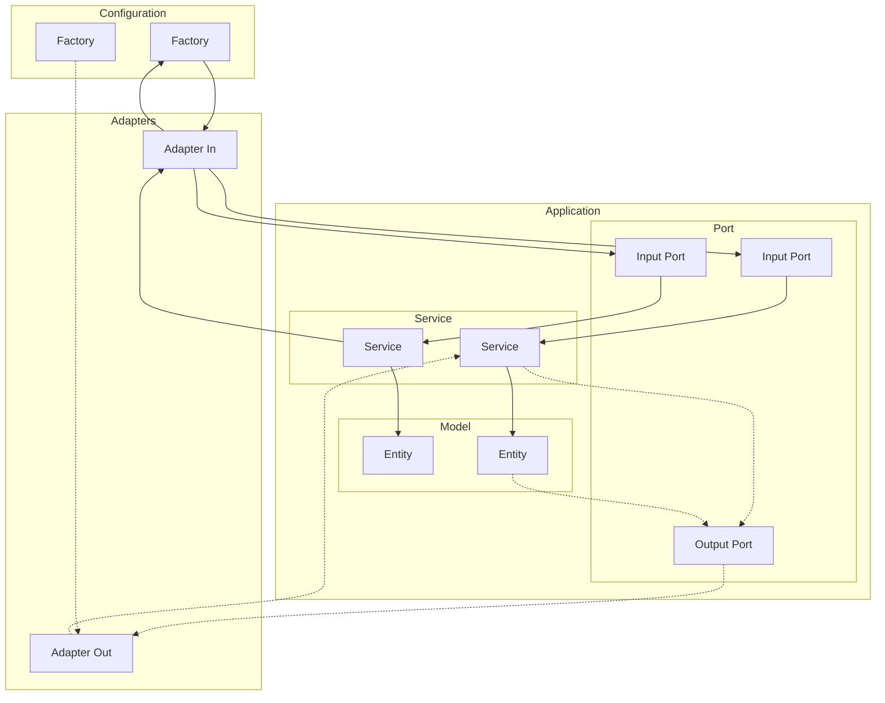
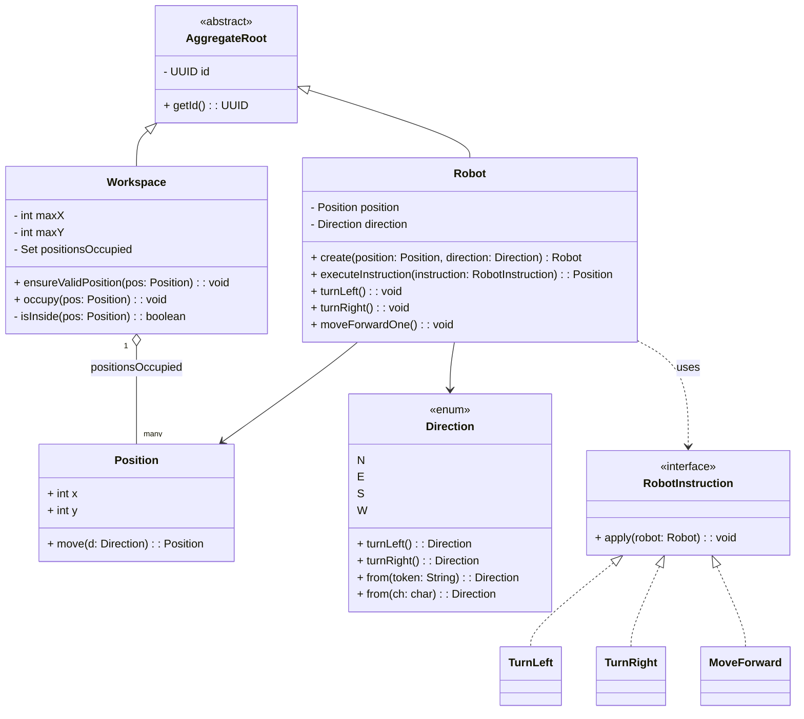

# Cleaner Robots – VW Digital Hub Backend Challenge

## Author
Germán Francisco Martínez Navarro

--- 

## Run Instructions

### Prerequisites
- Java 17
- Maven 3.9.11

### Build (skip tests)
```bash
mvn -q -e -DskipTests package
```

### Example of success execution
Then provide the workspace and robots input through stdin (sample from the statement):
```bash
java -jar target/cleaner-robots-hexagonal-1.0.0.jar << 'EOF'
5 5
1 2 N
LMLMLMLMM
3 3 E
MMRMMRMRRM
EOF
```
Expected output:
```bash
1 3 N
5 1 E
```

### Example of failed execution (out of bounds)

```bash
java -jar target/cleaner-robots-hexagonal-1.0.0.jar << 'EOF'
5 5
1 2 N
MMMMMMM
EOF
```
Expected output:
```bash
Exception in thread "main" com.vwdigitalhub.robots.application.domain.exception.OutOfBoundsException: 
Position out of bounds: Position[x=1, y=6]
```

### Example of failed execution (collision with a previously finished robot)

```bash
java -jar target/cleaner-robots-hexagonal-1.0.0.jar << 'EOF'
5 5
1 2 N
LMLMLMLMM
1 2 N
M
EOF
```
Expected output:
```bash
Exception in thread "main" com.vwdigitalhub.robots.application.domain.exception.OutOfBoundsException: 
Final position already occupied by another robot: Position[x=1, y=3]
```
---

## Architecture

The solution follows a **Hexagonal Architecture (Ports & Adapters)** combined with **Domain-Driven Design (DDD)** principles to ensure low coupling and a rich, testable domain.

The overall **package structure** is inspired by *Tom Hombergs’ approach* from his book *[Get Your Hands Dirty on Clean Architecture](https://github.com/thombergs/buckpal)*, which applies a clean layering model to align the codebase with business capabilities and enforce architectural boundaries.

### Layer Overview


### Main Packages
- `application.domain.model` – Entities, Value Objects, and Aggregates.
- `application.domain.service` – Implementations of the use cases. These services orchestrate the business logic encapsulated within the domain objects.
- `application.domain.port` – Input and output interfaces. In this project, there are no output ports yet (for example, for persistence or messaging).
- `adapters.in` – Driving adapters, i.e. the application’s entry points that initiate use cases (for example, a console or REST controller).
- `adapters.out` – Driven adapters, i.e. secondary actors that the application calls through output ports (for example, databases, message brokers, or external APIs).

---

## Domain Model


### Aggregate Roots
- **`Workspace`** – Defines the grid where robots operate. It enforces global invariants such as boundaries and occupied positions, ensuring no robot moves outside the allowed area or finishes on an already occupied cell.
- **`Robot`** – Represents the robot’s state and movement logic. It knows how to turn and move, but delegates boundary and collision validation to the `Workspace` through the application service.

### Value Objects
- **`Position`** - Immutable coordinate within the grid. Provides operations like moving in a direction while keeping value semantics (no side effects).
- **`Direction`** – Enum representing the robot’s orientation (N, E, S, W) and supporting rotations (`turnLeft`, `turnRight`) and directional movement (`moveForward`).
- **`RobotInstruction`** – Interface for individual movement commands, implemented by `TurnLeft`, `TurnRight`, and `MoveForward`. Each represents a single, stateless operation the robot can perform.

## Assumptions
The following assumptions define the domain invariants and constraints that the system always enforces.  
If any of these rules are violated, the program execution fails with an appropriate domain exception.

- No robot can move outside the defined `Workspace` boundaries.
- A robot cannot move into a cell already occupied by a previously finished robot.
- Robots are executed sequentially — one finishes its route before the next starts.
- The workspace is initially empty and rectangular, with no obstacles.
- Input format strictly follows the given specification (two lines per robot).

### Use Cases
- **`ExecuteInstructionsService`**: Orchestrates instruction execution, validates movements, and marks final positions.

---

## Design Decisions

- The domain defines **two Aggregate Roots** (`Workspace` and `Robot`), but they remain **decoupled**; coordination occurs entirely through the application service.
- The **Service layer** orchestrates the interaction between aggregates, validating positions with `Workspace` before applying each move to a `Robot`.
- Each robot, along with its own list of instructions, is processed through **its own use case invocation**. The application does **not** send all robots to a single use case for sequential processing; instead, each one is executed independently, ensuring clear separation of concerns and consistent aggregate boundaries.
- `Robot` is a **pure aggregate**, responsible only for maintaining and mutating its internal state; cross-aggregate invariants are enforced externally by the service and `Workspace`.
- The movement instructions (`TurnLeft`, `TurnRight`, `MoveForward`) are implemented as **Singletons** since they are stateless and immutable, avoiding unnecessary allocations while ensuring thread safety and fast lookup during instruction parsing.
- **Value Objects** are implemented as **Java records**, as records are inherently immutable and perfectly suited for representing domain values such as `Position` and `Direction`.
- **Static factory methods** (e.g., `Robot.create()`) are used to control aggregate creation and enforce invariants during instantiation.
- **No synchronization** is required since robots execute sequentially and all boundary and collision checks are handled via `Workspace`.
- The architecture emphasizes **testability and isolation**, allowing aggregates, services, and instructions to be tested independently without reliance on infrastructure or external frameworks.

---

## SOLID Practices

- **Single Responsibility Principle (SRP)**  
  Each class has one reason to change: `Robot` handles movement state; `Workspace` enforces global invariants; instructions (`TurnLeft`, `TurnRight`, `MoveForward`) encapsulate one action each.

- **Open/Closed Principle (OCP)**  
  New behaviors can be added without modifying existing code: introduce a new `RobotInstruction` implementation to extend movement semantics, or a new adapter under `adapters.*`.

- **Liskov Substitution Principle (LSP)**  
  `RobotInstruction` implementations (`TurnLeft`, `TurnRight`, `MoveForward`) can be used wherever a `RobotInstruction` is expected, preserving expected effects on `Robot`.

- **Interface Segregation Principle (ISP)**  
  Ports are narrow and focused: input ports expose only what callers need (use-case methods).

- **Dependency Inversion Principle (DIP)**  
  The application depends on abstractions, not concretions: use cases depend on **ports**, and adapters implement those ports. Domain model has no dependencies on frameworks or adapters.

---

## Run Instructions

### Prerequisites
- Java 17
- Maven 3.9.11

### Build (skip tests)
```bash
mvn -q -e -DskipTests package
```

---

## Testing

### Testing Strategy
- Unit and integration tests using **JUnit 5**.
- **JaCoCo** for code coverage.
- **PIT Mutation Testing** for robustness and reliability.

### Test Execution
```bash
mvn clean verify
```
HTML report available at: `target/site/jacoco/index.html`

### Mutation Testing
```bash
mvn org.pitest:pitest-maven:mutationCoverage
```
HTML report available at: `target/pit-reports/index.html`

---

## Project Structure

```
cleaner-robots-hexagonal/
├── src/
│   ├── main/
│   │   ├── java/com/vwdigitalhub/robots/
│   │   │   ├── application/
│   │   │   │   ├── domain/
│   │   │   │   │   ├── model/
│   │   │   │   │   │   ├── instructions/          # TurnLeft, TurnRight, MoveForward, RobotInstruction
│   │   │   │   │   │   └── (entities & VOs)       # Robot, Workspace, Position, Direction, AggregateRoot
│   │   │   │   │   ├── exception/                 # InvalidWorkspaceException, OutOfBoundsException, PositionOccupiedException
│   │   │   │   │   ├── port/
│   │   │   │   │   │   ├── in/                    # ExecuteInstructionsUseCase, DTOs (ControlRobotCommand/Response)
│   │   │   │   │   │   └── out/                   # (future) repositories, publishers, external services
│   │   │   │   │   └── service/
│   │   │   │   │       └── executeinstructions/   # ExecuteInstructionsService
│   │   │   └── adapters/
│   │   │       ├── in/
│   │   │       │   └── console/                   # ConsoleAdapter (stdin/stdout)
│   │   │       └── out/                           # (future) persistence/messaging adapters
│   └── test/
│       └── java/com/vwdigitalhub/robots/          # mirrors main packages (unit + integration tests)
├── pom.xml
└── README.md
```

---

## Conclusions

- The project follows a clean **Hexagonal Architecture** with strict separation between domain, application, and adapter layers.
- The domain is rich, cohesive, and fully testable.
- All validations are centralized in `Workspace`, with coordination handled by the service layer.
- The design ensures maintainability, scalability, and readiness for future extensions (REST API, microservice deployment, etc.).